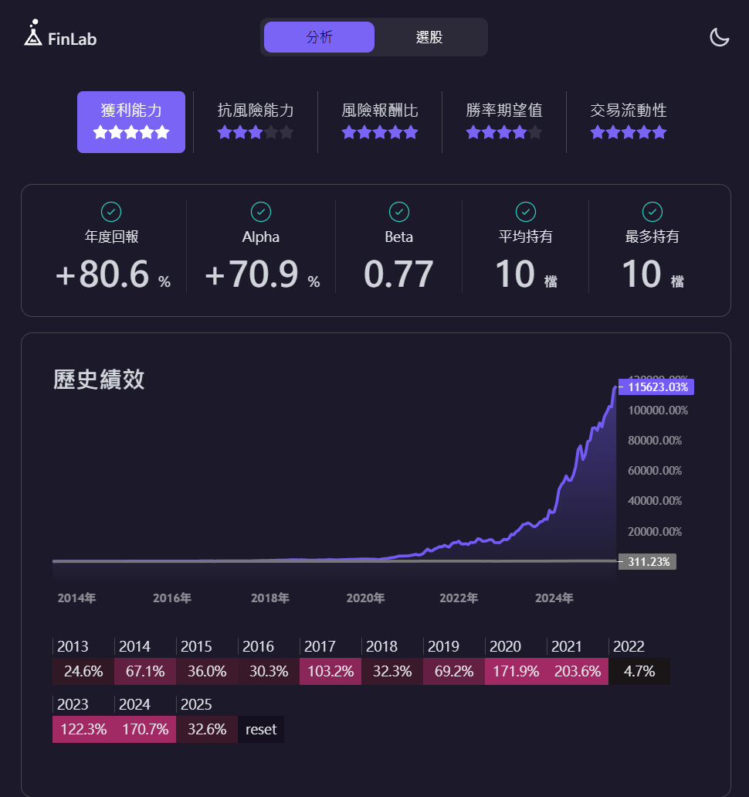
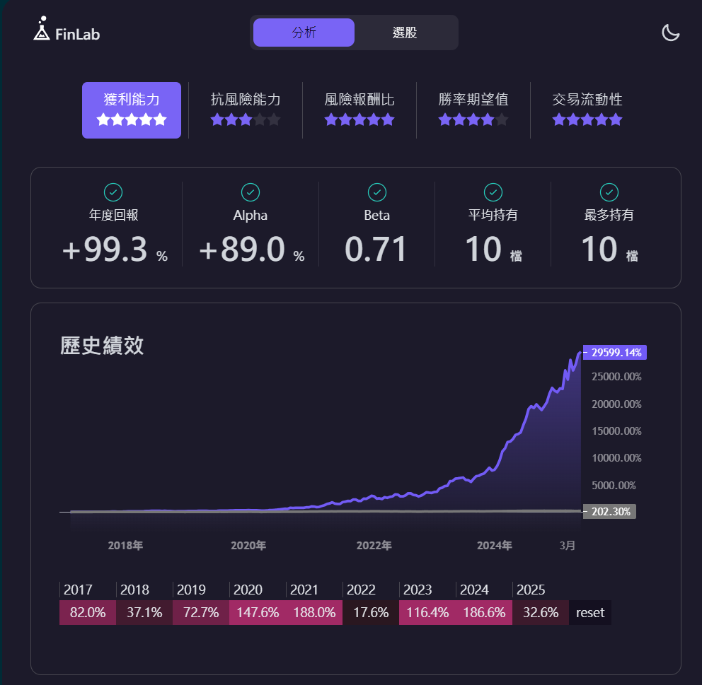
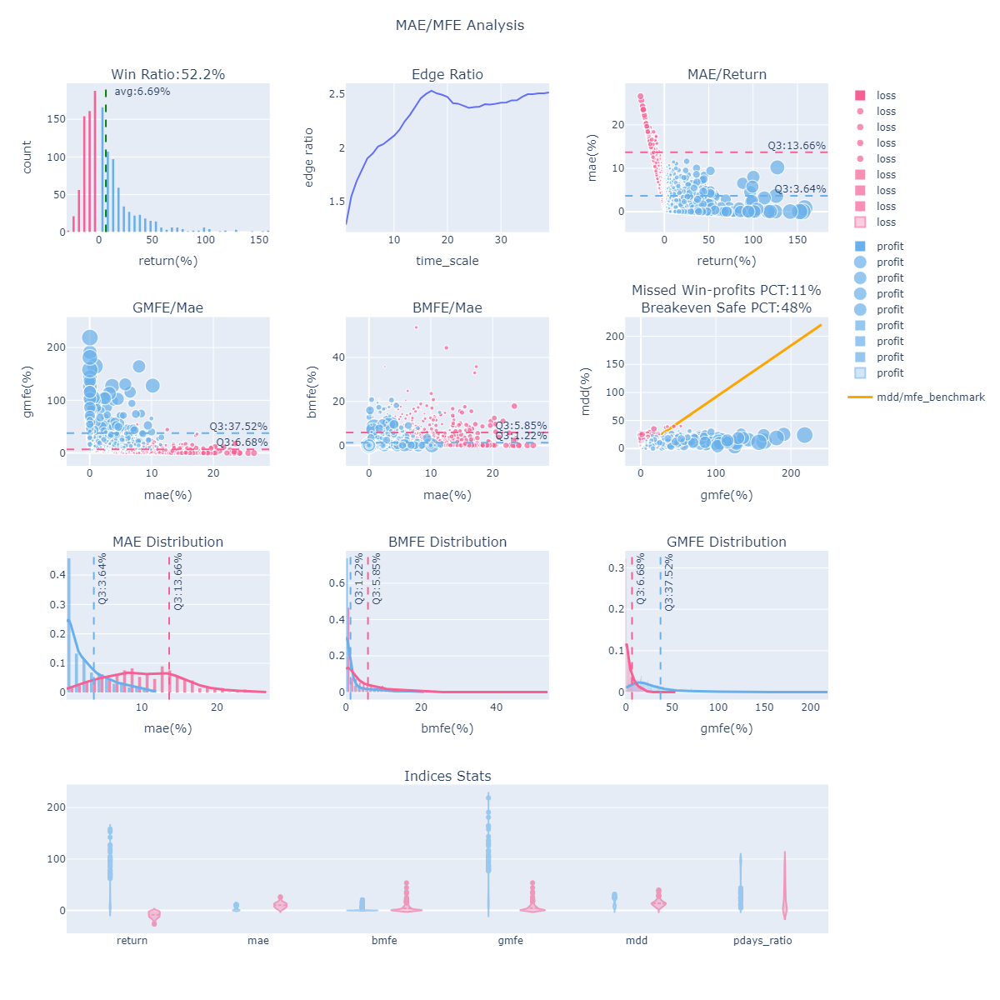
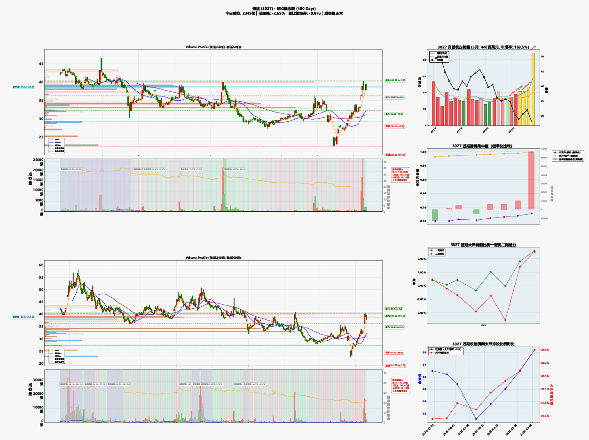
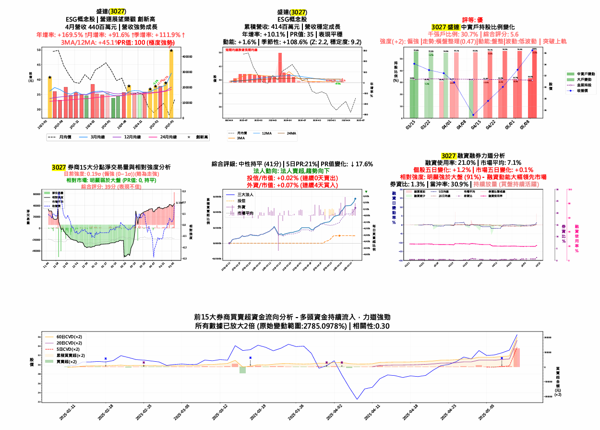
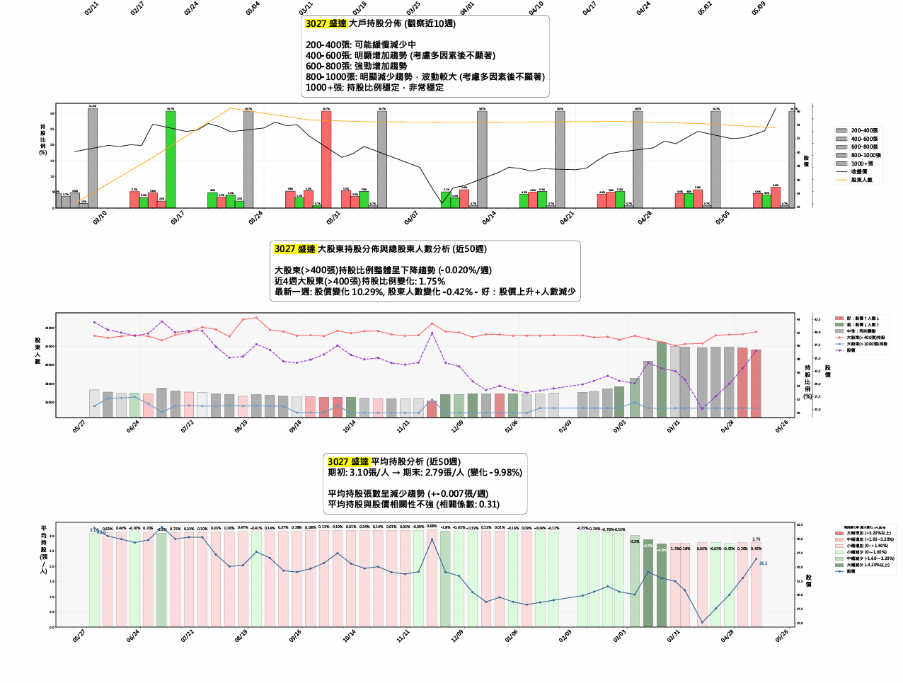

# UC_capital_resume

陳定康 — 面試優勢資本作品集

---

## 📈 2025 Out-of-Sample 策略

- 策略名稱：五日線強勢股（無籌碼 / 有籌碼）
- 回測樣本數 > 1200 筆，降低過擬合風險

---

## 🧠 策略與因子發想流程

- 策略方向：趨勢型策略為主
- 依據葉怡成教授的因子分類：
  - 獲利因子
  - 價值因子
  - 慣性因子
  - 風險因子
  - 規模因子
- 財報公布後，進行持股與波段交易（避免與高頻交易競爭）

---

## 📚 研究參考與觀察等例式

### 📘 國立清華大學：台股強勢股之關鍵指標研究

- 強勢股的融資使用率 3 個月上升者居多
- 融資每日增加對短期股價具推升力
- 券資比普遍低於 20%，且非長期連續訊號

---

### 📘 國立中山大學財管系：券商分點與機器學習

- 券商近 60 日淨買超與股價正相關
- 探討價量與籌碼面的機器學習預測效能

---

## 💸 小資族的主觀選股流程（量化後 + 主觀判斷）

1. 建立選股池
2. 檢查 K 線波動（過大、套牢、成交金額 > 1500 萬）
3. 營收爆發（轉盈或創新高） vs. 是否反映在股價
4. 檢查中實戶與散戶行為，觀察主力買入
5. 券商前 15 分點淨買超金額，每 5 日加總，觀察 8 週變化
6. 判斷融資使用率是否偏高（視為聰明錢）

---

## 🎓 學歷

**國立台北大學**

- 企業管理學系
- 不動產與城鄉環境學系（雙主修）

---

## 👋 自我介紹與申請動機

我是一位熱愛實作的選股研究者。從去年2024準備國考時期開始，為了解決資訊搜尋的需求，我自學前端與 GPT 技術，開發出爬蟲工具幫助自己抓取考古題。因為對台股的熱情，大學開始投入 Python 策略回測與資料分析，學習如何將想法轉化為可驗證的投資邏輯。

雖然我非金融本科，但我熟悉策略開發與回測流程，也具備一定程度的資料處理與因子研究經驗，曾閱讀多篇台股學界論文，實際驗證因子成效。我對機器學習僅有基本概念理解，但對 AI 在金融中的應用極感興趣，也願意從實戰中深入學習。這也是我想加入優式資本的原因：希望能進入一個重視研究與技術結合的實戰型團隊，向市場與程式高手們學習成長。

---

## 💡 為何我是適合的人選

### 1. 解決問題的能力

考試期間，為解決定時收看不動產專欄的不便，自學前端技術與 GPT 工具，開發自動抓取考古題的爬蟲專案：
🔗 [tomisagoodguy/landnote: 高點文章](https://github.com/tomisagoodguy/landnote)

---

### 2. 喜歡實作與數據分析

- 自學 Python 進行台股回測，使用 FinLab 套件
- 查閱台灣碩博士論文，研究與實作新因子策略

---

### 3. 熟悉量化交易中的基礎分析工具

- MAE / MFE
- IC / IR
- 面對過擬合問題後，改用 `rank` 相對排名機制提升穩定性

---

## 🧩 我的關鍵優勢

- 🧠 能夠從資料出發，自主定義問題與實作策略
- 💻 有量化策略開發經驗，熟悉 FinLab 框架與實際回測流程
- 📚 願意深入研究，並不怕從錯誤中優化
- 🛠 具備初步 AI/ML 理解，並願意實作與嘗試應用
- 🤝 樂於合作與學習，能與團隊成員共同完成專案目標

---

## 🎯 結語

我不敢說自己是最懂 AI 或金融的人，但我可以保證：
**我是那個會一行一行把策略做出來的人，也是那個最願意學、最願意做的那一個。**
